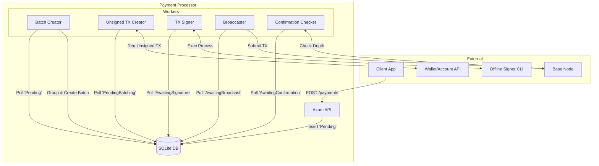

```mermaid
graph TD
    subgraph "External"
        Client[Client App]
        ExtAPI[Wallet/Account API]
        Signer[Offline Signer CLI]
        Node[Base Node]
    end

    subgraph "Payment Processor"
        API[Axum API]
        DB[(SQLite DB)]
        
        subgraph "Workers"
            W_Batch[Batch Creator]
            W_Unsigned[Unsigned TX Creator]
            W_Signer[TX Signer]
            W_Broadcast[Broadcaster]
            W_Confirm[Confirmation Checker]
        end
    end

    Client -->|POST /payments| API
    API -->|Insert 'Pending'| DB
    
    W_Batch -->|Poll 'Pending'| DB
    W_Batch -->|Group & Create Batch| DB
    
    W_Unsigned -->|Poll 'PendingBatching'| DB
    W_Unsigned <-->|Req Unsigned TX| ExtAPI
    
    W_Signer -->|Poll 'AwaitingSignature'| DB
    W_Signer <-->|Exec Process| Signer
    
    W_Broadcast -->|Poll 'AwaitingBroadcast'| DB
    W_Broadcast -->|Submit TX| Node
    
    W_Confirm -->|Poll 'AwaitingConfirmation'| DB
    W_Confirm <-->|Check Depth| Node
```
